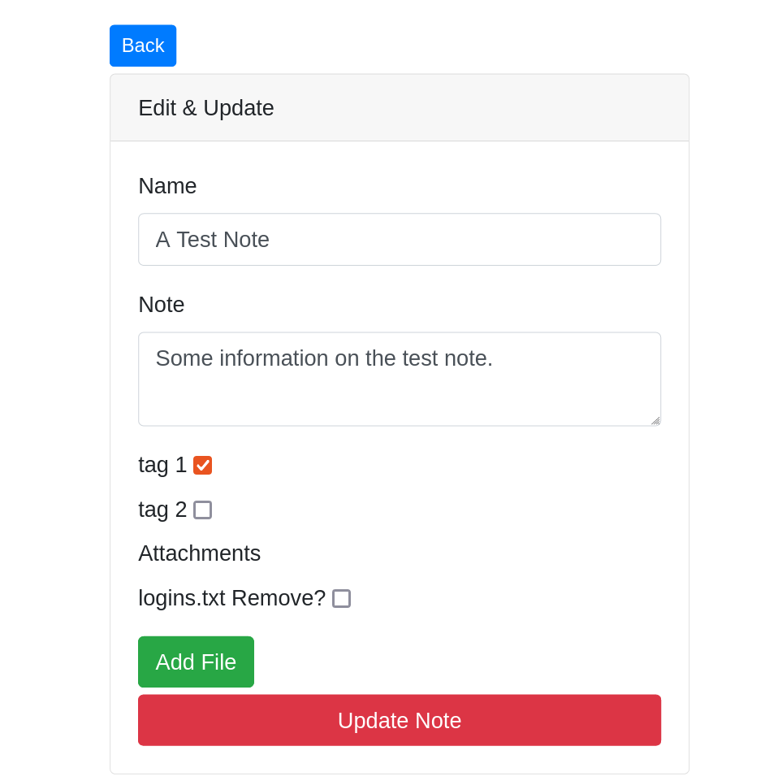
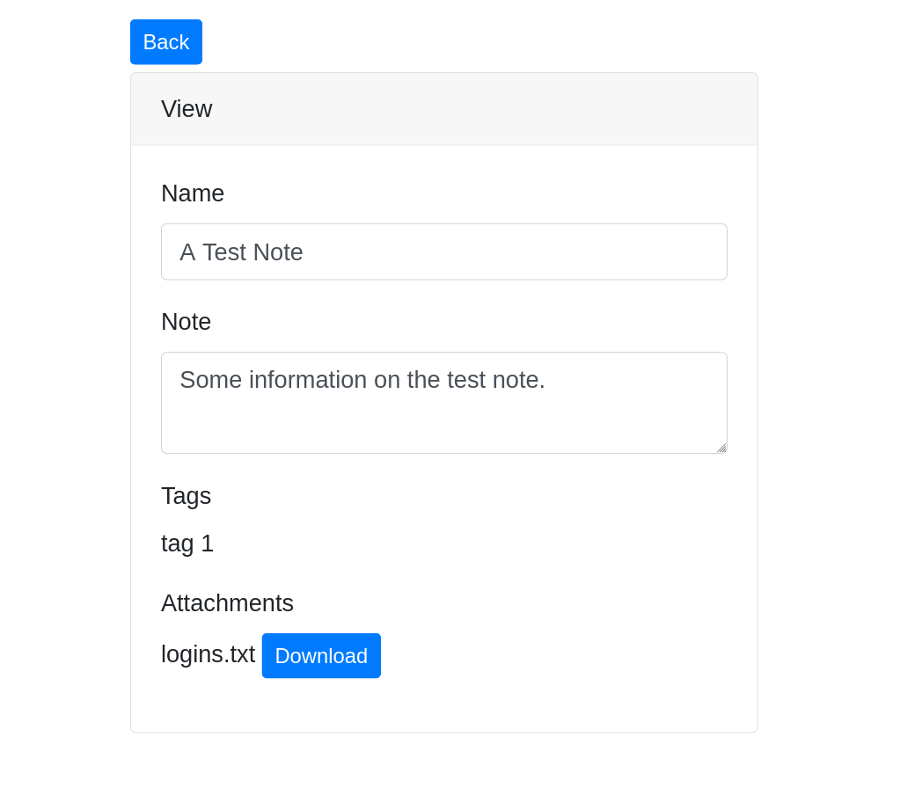
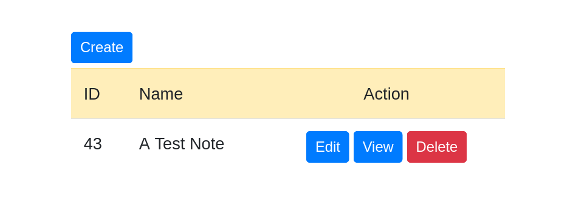
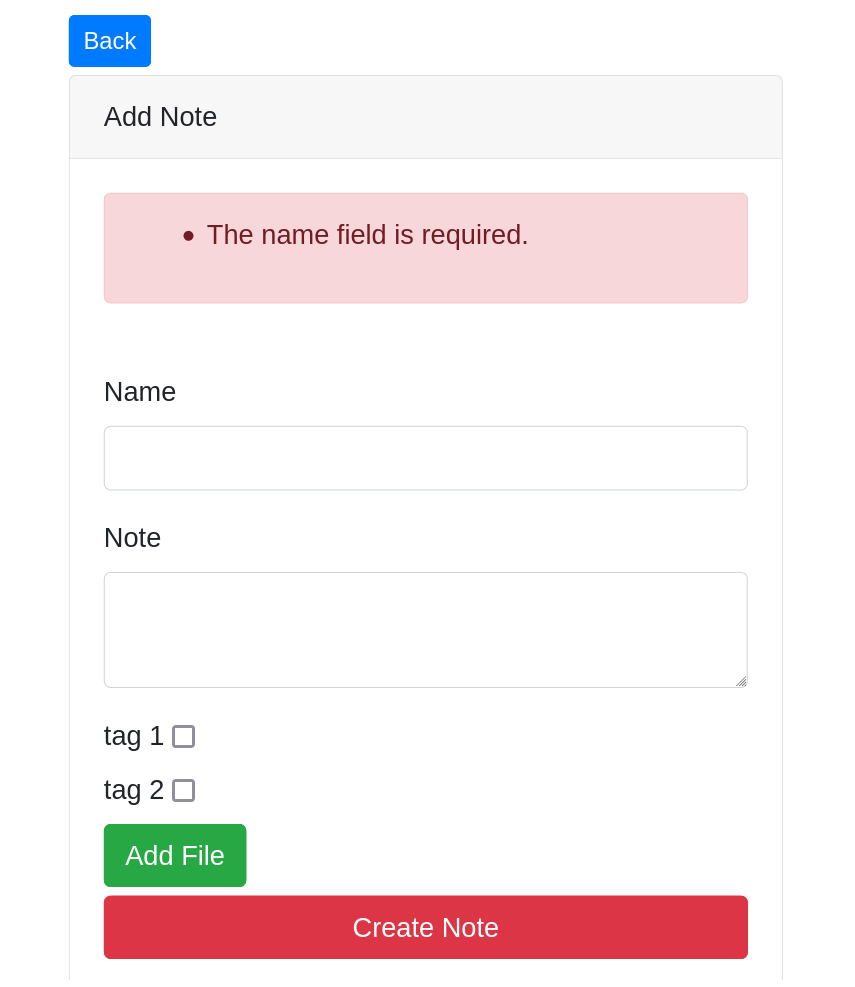
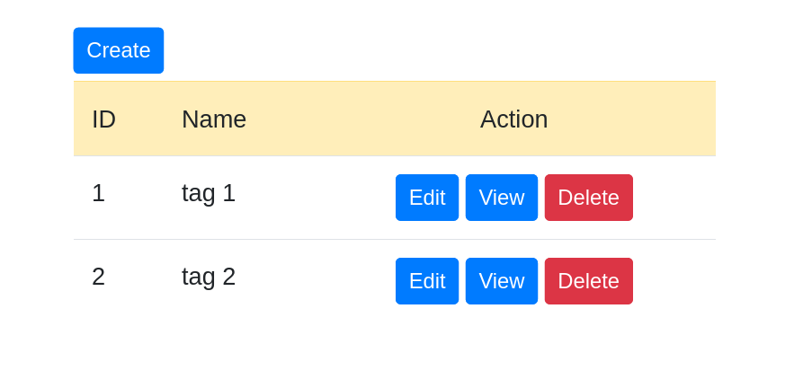

## About Notes
Notes is a simple demo project created using Laravel 8 to aid in my learning and understanding of this framework.

## So What Is It?
It takes the form of a small MVC base application which allows you to add simple Notes to a database. Each note can contain a number of pre defined Tags or a number of Attachments (files stored on the server for available for download). 

## So Whats The Point?
The point of this is to apply several common techniques used in everyday application development and to cement my understanding beyond just reading the API or watching tutorial videos. 

## Features
- An MVC application using a reasonably complex data model. So a "one to many" (1 Note to Many Attachments) and a "many to many" (Many Notes to Many Tags) DB relationships to the main Notes entity.
- Database layer is built using Laravel Migration classes.
- Attachments also include a downloadable file attachment. The logic for this is handled via a service layer class on the server.
- A simple frontend UI utilising blade templates and bootstrap including form validation.
- A basic API controller added where the user access is controlled via Laravel Passport (and Oauth based authorization and access system)
- Full PHPUnit feature tests coverage throughout (both for the UI controllers and API) allowing stable future  refactoring and a SOLID code design.

## Screenshots

## Future Enhancements
Some features I hope to add in the near future are
- DB Seeder to bulk add test Notes, Attachments and Tags, then pagination and search functionality to the UI.
- A user access system to the main user interface, possibly with different levels of user access
- finish other API functions for update, create and delete